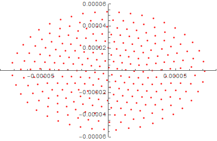
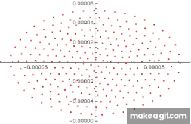

# 🌀 Simulation of Trapped Ion Micromotion Trajectories

Simulated the micromotion behavior of ions in a Paul trap to analyze their dynamics under RF fields.  
This work provides insights into optimizing trap parameters for stable confinement.

You can visualize the ion’s motion in phase space under an RF field using this simulation.

[← Back to Projects](/#projects)" in github, the website just show nothing

